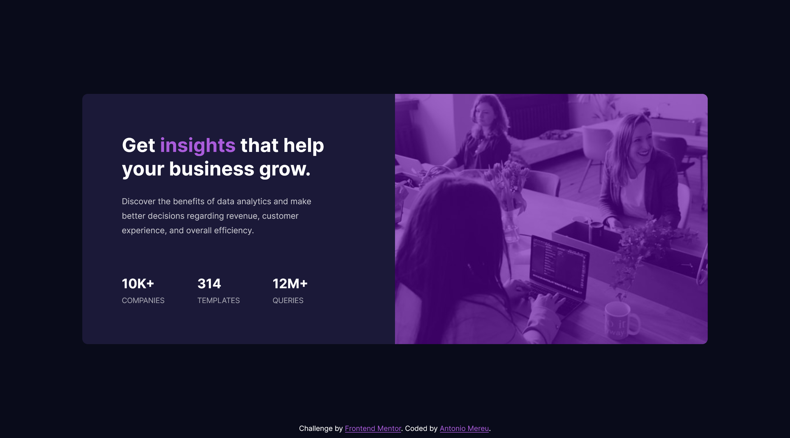

# Frontend Mentor - Stats preview card component solution

Thanks for checking out my solution to the [Stats preview card component challenge on Frontend Mentor](https://www.frontendmentor.io/challenges/stats-preview-card-component-8JqbgoU62). Frontend Mentor challenges help you improve your coding skills by building realistic projects.

## Table of contents

- [Overview](#overview)
  - [The challenge](#the-challenge)
  - [Screenshot](#screenshot)
  - [Links](#links)
- [My process](#my-process)
  - [Built with](#built-with)
  - [Useful resources](#useful-resources)
- [Author](#author)

## Overview

### The challenge

Users should be able to:

- View the optimal layout for the app depending on their device's screen size

### Screenshot

## Desktop

### Links

- Solution URL: [Solution on Frontend Mentor](https://www.frontendmentor.io/solutions/html-css-mobile-first-ENkByJCPjD)
- Live Site URL: [Live website](https://antoniomereu.github.io/stats-preview-card-component-Antonio-Mereu/)

## My process

### Built with

- Semantic HTML5 markup
- CSS custom properties
- Mobile-first workflow

### Useful resources

- [Microsoft Power Toys](https://learn.microsoft.com/it-it/windows/powertoys/) - I use Microsoft Power Toys a lot. It includes a tool called Screen Ruler, which is incredibly useful for measuring designs if you don't have the design Adobe XD or Figma file. Additionally it offers a wide range of other handy features, such as Color Picker, Text Grab and a lot more. My favorite tool since you can use it on any program, unlike chrome or other browsers where you have to install a bunch of extensions.

## Author

- Frontend Mentor - [@AntonioMereu](https://www.frontendmentor.io/profile/yourusername)
- Github - [@AntonioMereu](https://github.com/AntonioMereu/stats-preview-card-component-Antonio-Mereu)
